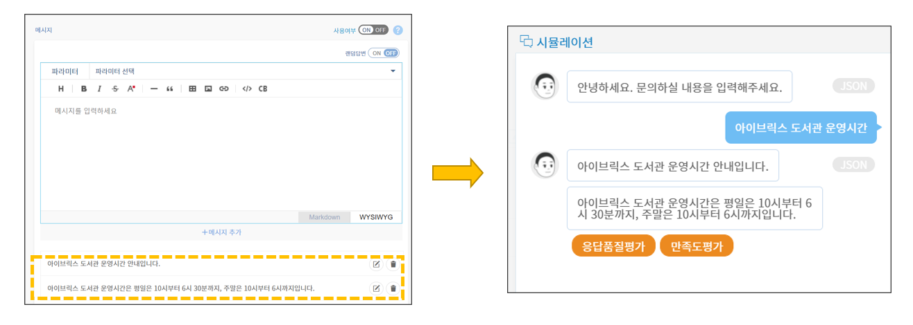
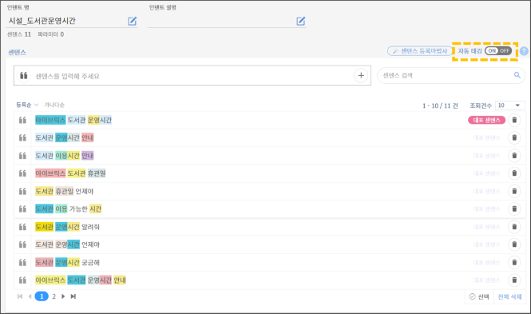
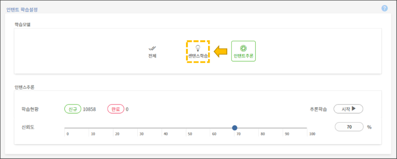
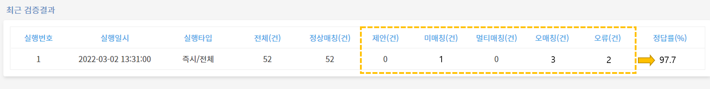

# 자주 묻는 질문

## 센텐스 관련 질문

### Q. 센텐스 등록 시 오류가 발생합니다.

센텐스 등록시 오류가 발생하지 않도록 다음의 사항들을 주의해주세요.

* **중복센텐스**

이미 등록된 센텐스와 동일한 센텐스의 경우 등록이 불가합니다. 한 인텐트 내 혹은 다른 인텐트와의 센텐스들은 중복되지 않게 주의해서 작성해야 합니다.     &#x20;

* **특수기호**

센텐스 끝에 특수기호 .(마침표),(쉼표)?(물음표)!(느낌표)는 들어갈 수 없습니다. 센텐스 중간에도 (특수기호 + 공백)이 들어갈 수 없습니다.


**센텐스 등록 시 허용되는 특수문자**

@ % \* / + {} () \[] , . : ＇ \_ = ? ! ^ 「」『』" ' ' - · whitespace


### Q. 자동완성 센텐스 변경 방법을 알려주세요.

센텐스의 일부만 입력해도 자동으로 완성되는 자동완성 센텐스는 해당 인텐트의 대표센텐스로 지정된 센텐스입니다. 이 자동완성 센텐스를 바꾸려면 해당 인텐트의 대표 센텐스를 변경해주시면 됩니다.

.png>)

**\[지식관리 > 인텐트]** 메뉴에서 인텐트 관리 페이지의 센텐스 등록 화면에서 기존 센텐스의 대표 센텐스 버튼을 해지하고 다른 센텐스를 대표센텐스로 지정하면 됩니다.

### Q. 센텐스 내에 모든 명사에 엔티티 태깅을 해야 하나요? &#x20;

응답 매칭률을 높이기 위해 센텐스 내 모든 명사에 엔티티를 태깅하는 것이 바람직합니다.                            &#x20;

.png>)

위의 예시는 "사용자 교육 신청" 관련 센텐스를 등록하여 엔티티를 태깅한 사례입니다. 1번은 '사용자'만 엔티티 태깅을 하고, '교육', '신청', '조건'과 같은 다른 명사는 태깅하지 않은 상태입니다. 응답 매칭률 향상을 위해 2번과 같이 모든 명사를 엔티티로 태깅하는 것이 바람직합니다.   &#x20;

## 응답 메시지 관련 질문

### Q. 응답메시지에 링크 주소/이미지/표를 넣은 방법을 알려주세요.

응답메시지 설정창에서 텍스트 도구 모음을 통해 세부사항들을 설정할 수 있습니다.&#x20;

.png>)

표시된 순서대로 표, 이미지, 하이퍼링크를 응답메시지 안에 삽입할 수 있는 기능입니다. 이외에도 응답메시지를 보다 효과적으로 전달하거나 메시지 안에 필요한 자료들을 삽입할려면 이 텍스트 도구 모음을 활용하시면 됩니다. &#x20;

### Q. 응답 메시지의 말풍선을 여러 개로 나누는 방법을 알려주세요. &#x20;

하나의 말풍선 안에 들어갈 글이 너무 길면 가독성이 떨어질 수 있습니다. 이런 경우, 말풍선을 여러 개로 나눠서 전달하면 챗봇의 응답이 보다 잘 읽힐 수 있습니다. 아래와 같이 응답 메시지 설정창에서 원하는 말풍선의 갯수만큼 응답 메시지를 추가하면 됩니다.

### Q. 여러 개의 응답 메시지를 랜덤으로 출력하는 방법을 알려주세요.

여러 개의 응답메시지를 구축하고, 사용자의 질의에 대한 답변은 랜덤으로 하나의 응답만 출력하게 할 수 있습니다. 응답메시지 설정창에서 랜덤답변을 OFF에서 ON으로 변경하면 됩니다.          &#x20;

.png>)

### Q. 응답 메시지에서 연관된 다른 인텐트로 연결하는 방법을 알려주세요. &#x20;

시나리오의 흐름상 연관된 인텐트로 연결이 필요한 경우, 버튼으로 연결이 가능합니다.

➊ 우선, 기존 인텐트의 응답메시지 설정창에서 버튼 템플릿을 만듭니다. label에는 버튼명을, value에는 버튼값을 기입하고, action은 query로 설정합니다.

➋ 설정한 value 값을 연결시킬 인텐트의 센텐스로 등록하고, 센텐스 학습 버튼을 클릭합니다.

아래와 같이, 기존 인텐트에서 버튼으로 다른 인텐트로 연결이 가능합니다.

.png>)

### Q. 버튼명/버튼 URL을 바꾸는 방법 알려주세요.  &#x20;

응답메시지 설정창의 템플릿 선택 화면에서 버튼 설정을 변경할 수 있습니다.&#x20;

버튼을 클릭시에 URL로 이동할 수 있도록 설정할려면 위 그림과 같이 action 값이 url이어야합니다. label 입력창에서 해당 버튼의 버튼명을 변경할 수 있습니다. value 입력창에서는 연결시킬 URL의 주소를 입력합니다.  &#x20;

### Q. 챗봇의 인사말/실패 메시지를 수정하는 방법을 알려주세요.

챗봇의 기본 대화 설정에서 인사메시지와 실패메시지를 수정할 수 있습니다. 해당 설정은 관리도구의 **\[설정 > 대화설정]** 메뉴에서 변경할 수 있습니다.

* **인사말 메시지 설정**

인사말 메시지 설정 화면에서 원하는 인사말 메시지를 수정하고 적용할 수 있습니다. &#x20;

&#x20;      &#x20;

* **실패 메시지 설정**

실패 메시지 설정 화면에서 원하는 실패 메시지를 수정하고 적용할 수 있습니다.&#x20;

챗봇의 기본 대화 설정에 대한 자세한 안내는 아래의 자세히 알아보기 버튼을 눌러주시기 바랍니다.

[챗봇의 기본 대화 설정 자세히 알아보기 > ](../undefined-1/undefined-1/undefined-3.md)

## 엔트리 관련 질문

### Q. 엔트리는 검색이 안되는지 알려주세요. &#x20;

엔티티 목록 페이지 내에서 검색은 엔티티만 가능합니다. 엔트리 및 유의어로는 검색이 불가합니다. 엔티티 목록 내에서 엔트리로 찾기를 원한다면, 엔티티 엑셀을 내려받아서 엑셀 파일 내에서 찾을 수 있습니다.

### Q. 엔트리와 유의어의 차이를 알려주세요.&#x20;

엔트리는 엔티티와 동일하거나 포함된 의미를 가진 키워드라고 할 수 있습니다. 유의어는 엔트리와 동일한 의미를 가진 키워드이며, 엔트리는 여러 개의 유의어를 가질 수 있습니다. 엔트리와 유의어에 대한 자세한 안내는 아래의 자세히 알아보기 버튼을 눌러주시기 바랍니다.   &#x20;

[엔트리와 유의어 자세히 알아보기 >](../undefined/undefined-2.md#1-1.)

## 엑셀 일괄 업로드 관련 질문 &#x20;

### Q. 엑셀 일괄 업로드 시 업로드가 정상 작동하지 않아요.&#x20;

지식 일괄 업로드 시에 정상적으로 Teana Studio에 탑재되지 않는 경우는 아래의 엑셀 시트 작성 규칙을 잘 따랐는지 확인해야 합니다

* **양식 및 시트명 확인**

엑셀 일괄 업로드의 주요 주의사항으로는 엑셀 양식명이나 시트명이 변경된 경우입니다. 각 엑셀 양식명과 시트명이 맞는지 확인이 필요합니다.&#x20;

[엑셀 업로드 양식 자세히 알아보기 > ](../undefined-1/undefined-1/undefined-2.md#2.)&#x20;

* **유의어 사이에 쉼표 입력**

엔티티 일괄 업로드를 통한 다수의 유의어 등록 시, 각 유의어 사이에 '쉼표(띄어쓰기 금지)'를 입력합니다. 유의어에 해당하는 엑셀 행에서 유의어 사이에 띄어쓰기가 사용되었는지 확인이 필요합니다.              &#x20;

* **특수문자 유무**

****

### **Q. 엑셀 일괄 업로드 했는데 자동 태깅이 되지 않아요.**

지식 일괄 업로드 시에 정상적으로 엔티티의 자동 태깅이 되지 않는다면 아래의 원인들을 **** 확인해야 합니다. ****    &#x20;

* **태깅설정 여부**&#x20;

자동 태깅 설정을 누락한 경우는 두 경로에서 확인할 수 있습니다.         ****                &#x20;

지식 일괄 업로드 시에 인텐트 엑셀의 "센텐스 시트"에서 자동 태깅을 설정할 수 있는데 해당 열이 일괄 "Y"로 기입이 되었는지 확인이 필요합니다.&#x20;

.png>)

지식 일괄 업로드 시트에서 문제가 발견되지 않았다면 관리도구 상에서 자동 태깅 설정이 제대로 되었는지 확인해봅니다. **\[지식관리 > 인텐트]** 메뉴에서 해당 인텐트의 센텐스 등록 화면에서 아래 그림에 표시된 자동태깅이 ON인지 확인이 필요합니다.                             &#x20;

* **업로드 순서**&#x20;

엑셀 일괄 업로드 시, 엔티티 일괄 업로드를 한 이후에 센텐스 및 응답을 등록해야 엔티티 자동 태깅이 가능합니다.  엔티티를 먼저 등록해야 연결 엔티티에 따라 자동 태깅이 가능하기 때문입니다. 이 경우, 업로드 순서를 확인한 후 엔티티 엑셀과 인텐트 엑셀을 순서대로 재업로드를 해야 합니다. &#x20;

&#x20;

* **유의어 사이에 공백 여부**

엔트리의 유의어 간 쉼표 좌측/우측/좌우측에 공백이 있었을 수 있습니다. 관리도구 상 엔티티 관리 페이지에서는 공백없이 등록된 것처럼 보이니, 엑셀 다운로드를 받아서 확인해야 합니다. 이 경우, 유의어 간 쉼표 주변의 공백을 제거한 후, 다시 유의어를 등록해주세요. 재등록해야 할 단어의 수가 많지 않다면 엔티티 관리 페이지에서 직접 입력해도 됩니다.&#x20;

### **Q. 수정된 엑셀을 업로드 했는데 응답이 중복으로 등록됩니다.**

센텐스 및 연결 엔티티를 수정하고 해당 엑셀을 업로드 했더니 아래와 같이 응답메시지가 중복으로 나타나는 현상이 발생하는 경우입니다.&#x20;

.png>)

이런 경우에는 일일이 응답메시지를 삭제해야하는 문제가 발생하기 때문에 주의해야 합니다. 수정된 엑셀을 등록할 경우에는 이전 데이터를 삭제 한 후에 재업로드해야지 중복 데이터가 발생하지 않습니다.

### Q. 엑셀로 엔티티를 일괄 업로드 했는데 유의어가 공란으로 보여요.

엔티티 엑셀에서 유의어를 작성할 때 입력셀에 띄어쓰기(공백)을 입력했거나 맨 마지막에 입력한 문자가 쉼표일 경우, 유의어 부분이 공란으로 등록됩니다.                 &#x20;

업로드된 엑셀의 유의어 셀을 확인하고 오류 원인을 파악합니다. 띄어쓰기를 없애거나 입력하려는 유의어가 없다면 유의어 입력 셀을 null 상태(공백 없이 모두 삭제)로 변경하세요. 혹은 입력 셀 맨끝에 입력된 쉼표를 삭제해주세요.

## **챗봇 응답 관련 질문**

### Q. 챗봇이 응답하지 않아요.

챗봇이 정상적으로 하지 않는 현상으로는 다음과 같은 원인들이 있습니다.

* **태깅 누락의 경우**

센텐스 내 주요 명사의 엔티티 태깅이 누락된 경우, 챗봇의 응답이 정상적으로 작동되지 않을 수 있습니다.태깅의 여부는 인텐트 관리 화면에서 센텐스 등록 화면에서 확인할 수 있습니다.&#x20;

엔티티 태깅 방법에 대한 자세한 안내는 아래의 자세히 알아보기 버튼을 눌러주시기 바랍니다.

[엔티티 태깅 자세히 알아보기 >](../undefined-1/undefined-1/undefined/undefined-1.md)

* **챗플로우 누락의 경우**

인텐트 생성 시 챗플로우를 추가하지 않으면 챗봇 답변이 출력되지 않는 오류가 발생합니다. 챗플로우 생성의 여부는 인텐트 관리 화면의 하단의 챗플로우 화면에서 확인할 수 있습니다.  &#x20;

챗플로우 추가하는 방법에 대한 자세한 안내는 아래의 자세히 알아보기 버튼을 눌러주시기 바랍니다.

[챗플로우 추가 자세히 알아보기 >](../undefined-1/undefined-1/undefined/undefined-5.md)

* **센텐스 학습 버튼 미클릭의 경우**

센텐스 학습 버튼을 미클릭시 챗봇이 수정사항을 학습하지 못할 수 있습니다. 센텐스 및 응답메시지 추가 및 변경사항이 있을 때는 반드시 관리도구 상단의  '**센텐스 학습**'  버튼을 클릭해주세요.

* **기계학습 설정에 따른 오류**

인텐트 학습 설정이 기계학습일 경우 오류가 발생할 수 있습니다. **\[설정 > 학습설정]** 메뉴에서 인텐트 학습 설정이 "센텐스 학습"으로 설정되어 있는지 확인이 필요합니다. 기계 학습 기반인 인텐트 추론 모델로 설정이 되어 있다면 센텐스 학습으로 설정을 바꿔주세요.   ****                   &#x20;

&#x20;      &#x20;

* **센텐스 중복에 따른 오류**

동일한 센텐스가 다른 인텐트에도 등록된 경우, 인텐트끼리의 혼선으로 오류가 발생할 수 있습니다. 센텐스 중복이 없는지 확인이 필요합니다. 일일히 인텐트 별로 확인하는 것보다 인텐트 엑셀을 일괄 다운로드해서 해당 엑셀의 센텐스 시트 내에 중복값이 있는지 확인할 수 있습니다.                   &#x20;

* **라이선스 적용이 안되었을 경우**

NLU 결과를 봤을 때,  NF(명사추정범주) 혹은 NR(미등록어)이 뜨면, 라이센스 미적용으로 간주됩니다. 담당 개발자에게 문의하세요.     ****   &#x20;

****

### Q. 챗봇이 계속 같은 말만 반복해요.

챗봇이 계속 같은 말만 반복하는 현상은 일시적인 오류일 수 있습니다. 재질의가 반복된다면 해당 시나리오에서 빠져나와 새로운 대화를 시도하는 방법이 있습니다.  **\[대화설정] > \[사용자]** 메뉴에서 설정된 대화중단 센텐스를 확인하고, 해당 센텐스를 질의하면 시나리오가 중단됩니다.&#x20;

.png>)

### Q. 응답률을 높이는 방법 알려주세요.

챗봇의 품질을 높이기 위해서는 챗봇이 질의에 대해 응답을 잘하는지 여부가 중요합니다. 응답률을 높이기 위한 방법은 다음과 같습니다.

* **오매칭 / 미매칭 발화 등록**

지식 검증을 실행한 후 검증 결과 화면에서는 챗봇의 유형별 매칭 오류 건수를 확인할 수 있습니다. 제안, 미매칭, 멀티매칭, 오매칭, 오류건들에 따라 챗봇의 정답률에 영향을 끼칩니다.   &#x20;

검증결과 상세 화면에서는 해당 오류 유형의 센텐스들을 확인할 수 있습니다. 센텐스들의 오류의 원인을 파악하거나 해결한다면 챗봇의 응답률을 보다 높일 수 있습니다.                           &#x20;

* **응답률 통계에서 미응답 등록**

응답률 통계 페이지에서 미응답 또는 인텐트가 잘못 매칭된 경우들을 확인할 수 있습니다. 해당 사용자발화를 학습문장(센텐스)로 직접 등록할 수 있습니다.

_<응답 통계 페이지에서 매칭 오류 출력 화면>_

미응답 센텐스를 등록하는 방법에 대한 자세한 안내는 아래의 자세히 알아보기 버튼을 눌러주시기 바랍니다.

[사용자 발화 등록 방법 자세히 알아보기 >](../undefined-2/undefined-2.md#undefined)

&#x20;   &#x20;

#### Q. 버튼 템플릿에서 label과 value 값이 동일해야하나요 ? &#x20;

보통은 일치시키는 편  사용자 편의를 위해 일치시는것을 권장한다     &#x20;

#### Q. 지식 일괄 업로드 엑셀 다운로드 시, 응답메시지 내 HTML 태그 없애는 방법이 있나요?

없어요,,,,,,,,

#### Q. 템플릿을 이용한 이미지 삽입과 말풍선 안에 이미지 삽입 하는 것의 차이는 무엇인가요?

개발에 따라 다름,,,,,,,,,   &#x20;
