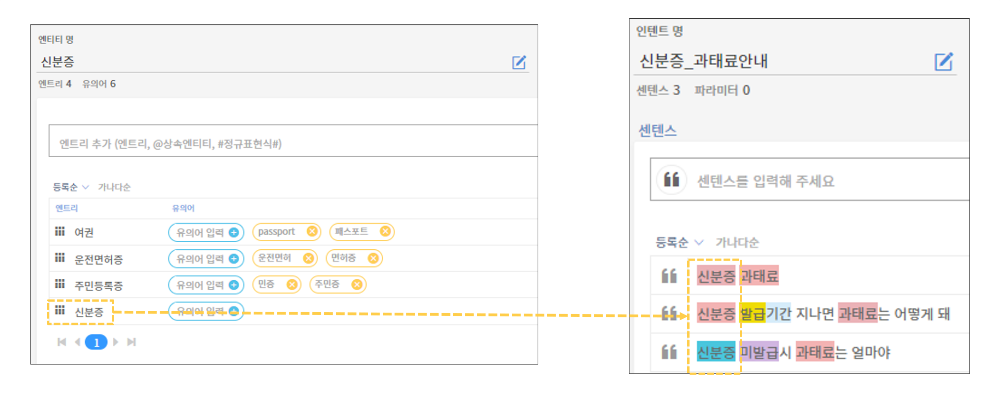

# 센텐스 구축 방법

#### 센텐스 고정 법칙

센텐스의 구축 요령에 들어가기 전에 센텐스 고정 법칙에 대한 이해가 필요합니다. 센텐스 고정 법칙은 아래와 같습니다.               &#x20;

* 등록 센텐스의 문법적 구성은 고정되어 있습니다.
* 사용자 질의가 등록 센텐스의 문법에서 벗어날 경우, 센텐스와의 매칭도가 하락됩니다. (매칭도 Score가 0.8 이상일 때 응답 매칭)  &#x20;

위의 예시는 "사용자 교육 신청"이라는 센텐스를 등록하고 학습한 뒤, 1번과 2번의 질의를 한 뒤 나온 NLU 분석 결과 화면입니다. 1번 질의인 "사용자 교육 신청은 어디서 해?" 라는 질의를 한 후에는 응답이 정상 매칭을 했지만 2번 질의인 "사용자 교육 받으려면 신청은 어디서 해?" 라는 질의를 한 후에는 매칭도 Score 값이 0.8 미만인 결과처럼 응답이 미매칭되었습니다.&#x20;

→ 즉, 등록 센텐스와 사용자 질의가 문법적으로 완벽히 일치하나 어미와 술어구가 길 경우에는 응답이 정상 매칭될 수 있지만, 등록 센텐스 사이에 동사 술어구를 질의할 경우, 문법적 구조가 깨져서 응답이 미매칭되는 것입니다. (단, 조사 및 어미는 센텐스 도중 질의하여도 영향이 없음)                                       &#x20;

&#x20;&#x20;

#### 센텐스 작성  요령&#x20;

➊ **간단 명료하게 작성합니다.** &#x20;

* 챗봇을 검색의 도구로 사용하는 이용자들이 있으므로, 단어 위주의 간단 명료한 센텐스부터 생성합니다.
* 긴 문장부터 학습시키면, 그보다 짧은 질의를 입력 받았을 때 응답 매핑이 되지 않습니다.&#x20;
* 단어 키워드형 센텐스에서 문장형 센텐스 순으로 확장합니다.

.png>)

위의 예시처럼, 단독 명사 또는 명사끼리 결합된 형태의 단어 키워드에서 조사 및 동사, 어미를 섞어 술어구를 덧붙인 형태로 센텐스를 확장하면 보다 다양하고 효율적인 센텐스 확장을 할 수 있습니다.

➋ **다양한 용언과 문장 구조를 활용합니다.**

* 명사는 엔티티로 확장할 수 있는 반면, 용언은 엔티티로 교체할 수 없기 때문에 용언을 다양하게 사용합니다**.**
* 센텐스를 구성하는 명사 구가 갖춰진 후, 센텐스를 이루는 술어의 위치를 섞어 문장 구조를 다양화 합니다.

.png>)

위의 예시처럼, "알고 싶어"라는 용언을 "듣고 싶어", "보고 싶어", "받고 싶어" 등으로 비슷한 의미의 용언으로 변경해줌으로써 센텐스를 확장할 수 있습니다. 또한, 센텐스를 구성하는 구의 위치를 조정해줌으로써 센텐스를 확장할 수도 있습니다. "교육 신청 어디서 받아"라는 하나의 센텐스에서 대명사 "어디"의 위치에 따라 지식의 구조를 확장시킬 수 있습니다.

아래 표는 센텐스의 구성 요소에 따라 응답 매핑에 영향을 주는 요소를 분류한 표입니다. 센텐스 구축 시에 참고하시길 바랍니다.                     &#x20;

.png>)

➌ **센텐스 확장 시에, 각 엔티티는 하나의 키워드만 사용합니다.**

* 구축한 엔티티를 다양하게 조합하여 센텐스를 작성합니다.
* 다만, 데이터 낭비 및 같은 문법 룰의 재입력을 피하기 위해 엔티티에 소속된 엔트리 중 하나만 사용합니다.                    &#x20;

위 예시처럼, 센텐스를 이루는 엔티티는 엔트리 중 하나(신분증)만을 활용하여 확장했습니다. 하나의 엔티티에 소속된 다수의 엔트리를 섞어서 사용하면 작업시 혼란이 생겨나고 센텐스의 확장성도 떨어집니다. 참고로, 엔티티로 사용된 키워드도 반드시 엔트리에 포함되어야 합니다.                          &#x20;

**센텐스 구축 예시 : \[관리자교육\_신청안내]**

아래는 \[관리자교육\_신청안내] 인텐트에 대한 센텐스 구축 예시입니다. 각 센텐스 확장의 좋은 예시와 나쁜 예시를 비교해보세요.          &#x20;

