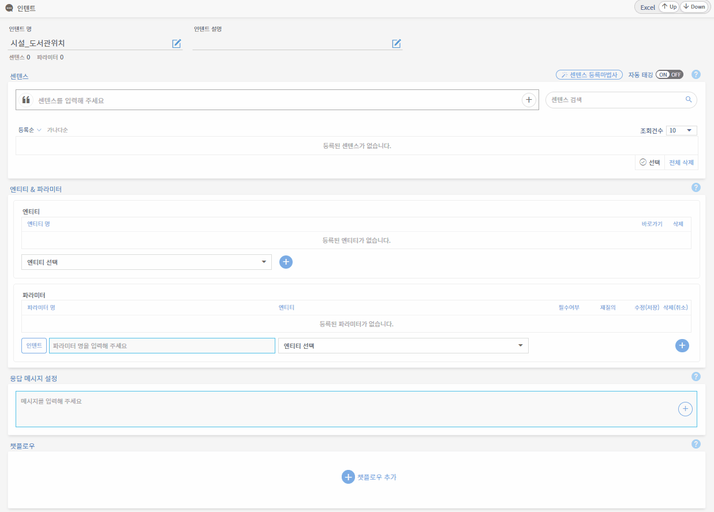

# 지식 일괄 업로드

## 1. 지식 일괄 업로드 개념

신규 구축할 지식의 양이 많을 경우, 일괄 업로드 기능을 활용합니다. 엔티티, 인텐트, 센텐스, 응답메시지들을 일일이 Teana Studio에 직접 작성하지 않아도 엑셀 템플릿에 작성하여 일괄 등록할 수 있는 기능입니다. 대량의 지식들을 추가하거나 관리가 필요한 경우, 이 지식 일괄 업로드 기능을 활용하는 것을 권장합니다. 엑셀 템플릿에 대한 세부 작성 규칙은 아래 내용을 살펴봐주시기 바랍니다.                                         &#x20;

## 2. 엔티티 일괄 업로드

엔티티 일괄 업로드는 엔티티, 엔트리, 유의어를 일괄 업로드할 수 있습니다. 엔티티 목록 화면에서 오른쪽 상단에 있는 에서 Up 버튼을 눌러서 해당 지식 엑셀을 업로드할 수 있습니다. 반드시 엔티티 업로드를 해서 먼저 등록한 후에 센텐스 및 응답을 등록해야 엔티티 자동 태깅이 가능합니다. 아래는 엔티티 엑셀 템플릿 작성 규칙 안내입니다.

.png>)

* **엔티티** **:** 인텐트에 해당하는 엔티티를 입력합니다.
* **엔트리 :** 엔티티에 속하는 엔트리를 입력합니다.
* **유의어** **:** 엔트리와 동일한 의미를 가진 유의어를 입력합니다.    &#x20;


**유의어 작성 및 등록 관련 주의사항**

엔티티 일괄 업로드를 통한 다수의 유의어 등록 시, 각 유의어 사이에 '쉼표(띄어쓰기 금지)'를 입력합니다.

※ 예시 : 규칙, 규범 (X) / 규칙,규범 (O)               &#x20;


## 3. 인텐트 일괄 업로드

인텐트 일괄 업로드는 모든 인텐트, 파라미터, 센텐스, 응답메시지를 일괄 업로드할 수 있습니다. 인텐트 목록 화면에서 오른쪽 상단에 있는  에서 Up 버튼을 눌러서 엑셀을 업로드할 수 있습니다. 래는 인텐트 엑셀 템플릿 작성 규칙 안내입니다. 해당 엑셀은 인텐트, 파라미터, 센텐스, 응답메시지 시트로 구성됩니다.                   &#x20;

### 3-1. 인텐트 시트

.png>)

각 시트에 있는 행의 기능에 따라 정확히 입력해야지 업로드 시 오류가 생기지 않습니다.           &#x20;

* **인텐트** **:** 인텐트 이름을 입력합니다.
* **멀티설정 :**[ 멀티인텐트 ](undefined-3.md#2-5.)여부 ON(Y) / OFF(N)를 설정합니다. &#x20;
* **디스플레이명** **:** 멀티인텐트 발생 시, 챗봇 응답 화면에 출력되는 인텐트 이름을 입력합니다.&#x20;
* **챗플로우 :** 입력된 이름으로 챗플로우가 자동 생성됩니다.

### 3-2. 파라미터 시트

.png>)

각 시트에 있는 행의 기능에 따라 정확히 입력해야지 업로드 시 오류가 생기지 않습니다.

* **인텐트명 :** 인텐트 이름을 입력합니다.
* **연결엔티티 :** 해당 인텐트의 연결엔티티를 입력합니다.
* **파라미터 :** 해당 인텐트의 파라미터를 입력합니다.

### 3-3. 센텐스 시트       &#x20;

.png>)

각 시트에 있는 행의 기능에 따라 정확히 입력해야지 업로드 시 오류가 생기지 않습니다.

* **인텐트명 :** 인텐트 이름을 입력합니다.
* **센텐스 :** 해당 인텐트의 센텐스를 입력합니다.
* **태깅설정** **:** 자동 태깅 여부 ON(Y) / OFF(N)를 설정합니다.&#x20;
* **대표센텐스 :** 대표  여부 ON(Y) / OFF(N)를 선택합니다.       &#x20;

### 3-4. 응답메시지 시트

.png>)

각 시트에 있는 행의 기능에 따라 정확히 입력해야지 업로드 시 오류가 생기지 않습니다.         &#x20;

* **인텐트명** : 인텐트 이름을 입력합니다.
* **응답메시지** : 해당 인텐트의 응답메시지를 입력합니다.
* **랜덤설정** : 무작위 응답 출력 여부 ON(Y) / OFF(N)를 설정합니다.

## 4. 센텐스 일괄 업로드

센텐스 일괄 업로드의 경우, 특정 인텐트에 해당하는 센텐스와 엔티티, 응답메시지를 일괄 업로드 할 수 있습니다. 엑셀 템플릿은 인텐트 일괄 업로드 엑셀과 동일하지만 업로드하는 경로는 다릅니다. 인텐트 관리 화면에서 오른쪽 상단에 있는  에서 Up 버튼을 눌러서 해당 엑셀을 업로드해야 센텐스가 일괄 업로드됩니다.

## 5. 엑셀 일괄 업로드 주의사항

엑셀 업로드 양식 및 시트명 변경 시 업로드가 불가하니 주의해야 합니다.

