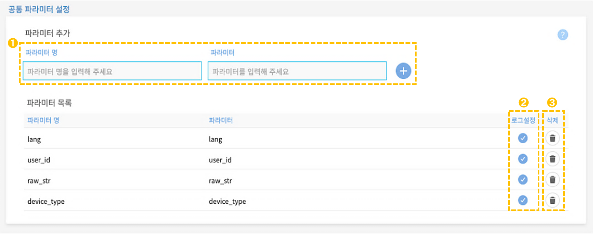
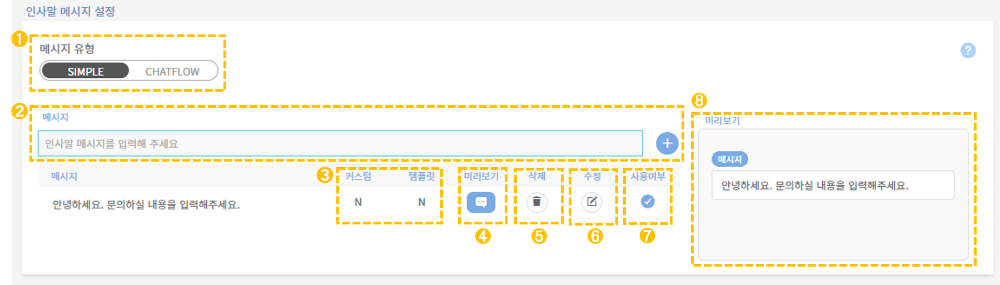
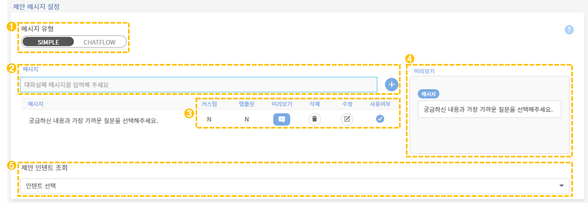
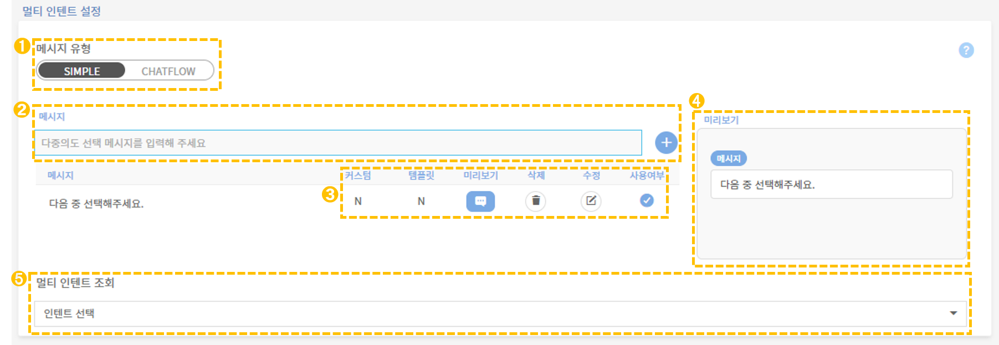
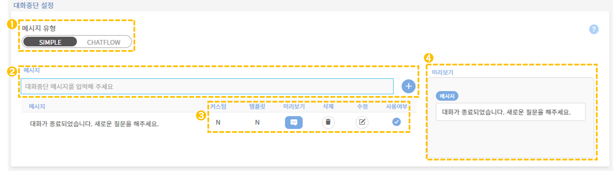
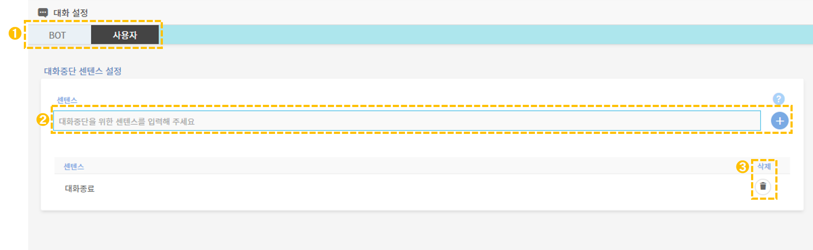

# 기본 대화 설정

## 1. 기본 대화 설정 개념

기본 대화 설정은 챗봇 대화의 기본 요소를 설정할 수 있습니다. 대화 설정은 공통 파라미터 설정, 인사말 메시지 설정, 실패 메시지 설정, 만족도 메시지 설정, 멀티 인텐트 설정, 대화중단 설정(BOT/사용자), 품질 조사 설정, 만족도 조사 설정의 총 8개 영역으로 이루어져 있습니다.&#x20;

## 2. 기본 대화 설정&#x20;

관리도구 좌측의 **\[설정 > 대화설정] 메뉴**를 통해 기본 대화 설정 및 관리가 가능합니다.

### 2-1. 공통 파라미터

공통 파라미터 설정에서는 특정 인텐트에 종속되지 않고 범용적으로 사용하는 파라미터를 설정할 수 있습니다. 공통 파라미터를 정해서 생성하면 목록에서 로그를 설정하고 삭제할 수 있습니다. 공통 파라미터로 사용자의 정보를 입력 받도록 정의하여 응답메시지나 챗플로우 조건 등으로 다양하게 활용 가능합니다.&#x20;

공통 파라미터 설정 화면의 각 기능에 대한 상세 안내입니다.     &#x20;

➊ **공통 파라미터 추가**

공통 파라미터로 설정할 파라미터를 이름과 함께 입력한 후 .png>)버튼을 클릭하면 생성됩니다. &#x20;

➋ **로그 설정**

선택한 파라미터는 대화 로그에 저장됩니다.

➌ **파라미터 삭제**&#x20;

삭제하고 싶은 파라미터의 휴지통 아이콘을 클릭하면 목록에서 삭제됩니다.

&#x20;


**현재 모든 채팅이 운영 중인 챗봇에 맞추어져 있는 상태이므로, 최대한 수정하지 않는 것을 권장드립니다.**   &#x20;


### 2-2. 인사말 메시지

인사말 메시지는 사용자가 처음 진입했을 때 챗봇의 인사말에 대한 메시지 설정을 말합니다. 메시지 유형의 기본값은 SIMPLE이며 단순 메시지가 출력됩니다.&#x20;

인사말 메시지 설정 화면의 각 기능에 대한 상세 안내입니다.&#x20;

➊ **메시지 유형 선택** &#x20;

메시지 유형을 SIMPLE / CHATFLOW 중에 선택할 수 있습니다.

* **SIMPLE :** 챗봇이 사용할 간단한 메시지를 입력할 수 있습니다.
* **CHATFLOW :** 선택 시에 구축되어 있는 챗플로우 중 1개를 선택하여 단순 메시지 대신 사용할 수 있습니다.

➋ **신규 메시지 생성** &#x20;

인사말 메시지를 정해서 입력한 후 .png>)버튼을 클릭하거나 엔터를 누르면 생성됩니다.

&#x20;  &#x20;

➌ **커스텀/템플릿 사용 여부**&#x20;

메시지에 대한 커스텀이나 템플릿의 사용 **** 여부 Y/N 를 선택할 수 있습니다.

&#x20;    ****    &#x20;

➍ **미리보기**&#x20;

말풍선 아이콘 클릭 시 우측 미리보기 섹션에서 출력된 메시지를 확인할 수 있습니다. 인사말 메시지 2개 이상인 경우에는 미리보기 섹션에서 확인할 메시지를 선택할 수 있습니다.

➎ **메시지 삭제**&#x20;

삭제하고 싶은 메시지의 휴지통 아이콘을 클릭하면 목록에서 삭제됩니다.&#x20;

➏ **메시지 수정**&#x20;

기존 메시지 내용의 수정, 커스텀 코드 설정, 템플릿 설정, 감정표현 설정이 가능합니다.

➐ **사용여부**&#x20;

메시지가 2개 이상인 경우, 사용할 인사말 메시지를 선택할 수 있으며, 선택하지 않는 경우에는 랜덤하게 출력됩니다.

➑ **미리보기 창**

&#x20;미리보기 섹션으로 만든 메시지의 출력된 형태를 확인할 수 있습니다.

### 2-3. 실패 메시지

실패 메시지는 챗봇이 사용자 의도를 파악하는데 실패했을 때 전달하는 메시지입니다. 사용자 발화가 현재 지식 구축 데이터 안에서 매칭되지 않는 경우, 챗봇은 사용자 의도 파악에 실패했다는 메시지를 출력합니다.&#x20;

기본적인 메시지 설정 방법은 인사말 메시지와 같습니다.

.png>)

➊ **메시지 유형 선택**

➋ **신규 메시지 생성**

➌ **커스텀/템플릿/미리보기/메시지 삭제 및 수정/사용 여부 표시**

➍ **미리보기 창**

### 2-4. 제안 메시지

사용자의 질의가 어떤 인텐트와도 정확히 연결되지 않을 때, 챗봇은 가장 유사한 질의가 포함된 인텐트로의 연결을 제안합니다. 이때 인텐트가 미매칭된 경우에 챗봇이 사용자에게 제안할 인텐트를 설정하는 파트입니다. 해당 인텐트를 전달하면서 챗봇이 사용할 간단한 제안 메시지를 생성할 수 있습니다.&#x20;

기본적인 메시지 설정 방법은 인사말 메시지와 같습니다.

➊ **메시지 유형 선택**

➋ **신규 메시지 생성**

➌ **커스텀/템플릿/미리보기/메시지 삭제 및 수정/사용 여부 표시**

➍ **미리보기 창**

➎ **제안 인텐트 조회**&#x20;

인텐트 미매칭 시에 챗봇이 안내 메시지와 함께 제안할 인텐트를 선택해서  버튼을 눌러 설정할 수 있습니다.&#x20;

.png>)

선택된 제안 인텐트에 따라 다음과 같은 응답메시지가 나타납니다.  &#x20;

.png>)

### 2-5. 멀티 인텐트

사용자의 발화에 대해 지식구축 데이터 중 정확도가 높은 인텐트가 동일하게 여러 건이 확인되는 경우, 멀티 인텐트가 발생하였다고 합니다. 즉, 사용자의 질의가 여러 개의 의도와 연결되었을 때 멀티 인텐트 상태가 됩니다.&#x20;

멀티 인텐트가 발생했을 때 아래의 설정 방법에 따라 처리가 가능합니다. 기본적인 메시지 설정 방법은 인사말 메시지와 같습니다.&#x20;

* **사용자 선택** &#x20;

사용자가 직접 어떤 의도였는지 원하는 내용을 선택하도록 설정할 수 있습니다. 이 경우, 사용자에게 노출시킬 인텐트 버튼명을 설정하고 선택 안내 메시지를 설정해야합니다.

* **연결 인텐트 고정**  &#x20;

해당 기능을 해제하면 무조건 하나의 인텐트에 매칭되도록 설정할 수 있습니다.   &#x20;

➊ **메시지 유형 선택**

➋ **신규 메시지 생성**

➌ **커스텀/템플릿/미리보기/메시지 삭제 및 수정/사용 여부 표시**

➍ **미리보기 창**

➎ **멀티 인텐트 조회**&#x20;

멀티 인텐트 설정 하단에는 각 인텐트에 대한 멀티 인텐트 사용 여부와 사용자에게 노출될 인텐트명을 설정할 수 있습니다.

.png>)

### 2-6. 대화중단

대화중단 설정은 챗봇과 사용자 측에서 설정할 수 있습니다. 대화중단 설정 화면의 각 기능에 대한 상세 안내입니다.                        &#x20;

#### 챗봇의 종료 메시지 설정

사용자의 요청 등으로 챗봇에서 진행되고 있던 대화의 중단이 가능합니다. 사용자가 대화 중단을 요청할 때 사용할 센텐스를 설정하며, 대화 중단 시 챗봇이 전달하는 종료 메시지를 설정할 수 있습니다.

기본적인 메시지 설정 방법은 인사말 메시지와 같습니다.

➊ **메시지 유형 선택**

➋ **신규 메시지 생성**

➌ **커스텀/템플릿/미리보기/메시지 삭제 및 수정/사용 여부 표시**

➍ **미리보기 창**

****

#### 사용자의 종료 메시지 설정

사용자 측에서 대화를 중단하는 메시지를 설정할 수 있습니다. 상단의 버튼 중 \[사용자]를 선택하면 **대화중단 설정(사용자)**으로 진입이 가능합니다.

➊ **대화설정 선택**&#x20;

상단의 BOT/사용자 버튼에서 \[사용자]를 눌러야 사용자 대화중단 설정 화면이 나타납니다. 기본값은 BOT 대화중단 설정 화면입니다.&#x20;

➋ **신규 메시지 생성** &#x20;

대화중단을 위한 메시지를 입력한 후 .png>)버튼을 클릭하거나 엔터를 누르면 생성됩니다. &#x20;

➌ **메시지 삭제**&#x20;

삭제하고 싶은 메시지의 휴지통 아이콘을 **** 클릭하면 목록에서 삭제됩니다.&#x20;

### 2-7. 응답 품질 조사

사용자는 챗봇과 대화 후 챗봇의 응답 품질에 대해 평가할 수 있으며, 이때 품질 조사에 사용될 평가 항목별 메시지를 설정할 수 있습니다. 응답 품질 조사 설정 화면은 '평가 항목 정의'와 '메시지' 설정 화면으로 구성됩니다.

➊ **항목**&#x20;

응답품질 평가항목은 '정상매칭, 오매칭, 정보오류, 기타'로 분류됩니다.

* **정상매칭 :** 답변이 정상적으로 매칭된 경우
* **오매칭 :** 발화가 특정 답변에 매칭되긴 했으나 잘못되거나 어색한 답변이 매칭된 경우&#x20;
* **정보오류 :** 메시지 내용 중에 잘못된 정보나 오류가 있는 경우
* **기타 :** 그 외 나머지 응답 품질에 있어 문제라고 생각되는 경우                                   &#x20;

➋ **답변항목**&#x20;

평가 항목별로 사용자에게 제시되는 버튼명입니다.

➌ **커스텀/템플릿/미리보기/메시지 삭제 및 수정/사용 여부 표시**

➍ **미리보기 창**

응답 품질 답변 메시지 설정 방법도 기본적으로 인사말 메시지와 같습니다.

➊ **신규 메시지 생성**

➋ **커스텀/템플릿/미리보기/메시지 삭제 및 수정/사용 여부 표시**

➌ **미리보기 창**

### 2-8. 서비스 만족도 조사

사용자는 챗봇의 전반적인 서비스에 대해 평가할 수 있으며, 각각의 평가 항목에 대응하는 챗봇의 응답 메시지를 설정할 수 있습니다. 서비스 만족도 조사 설정 화면의 각 기능에 대한 상세 안내입니다.

➊ **만족도 평가 항목수 선택**

만족도 평가에 선택할 수 있는 항목 수를 설정할 수 있습니다. 항목 수는 2\~5개까지 설정 가능하며 비활성화를 누를 시에 서비스 만족도 조사를 설정할 수 없습니다.       ****              &#x20;

➋ **연결 파라미터** &#x20;

만족도 조사에 사용될 파라미터를 설정할 수 있습니다.  &#x20;


**만족도 평가 항목 수 및 연결 파라미터의 경우, 챗봇의 화면과 연결되어 있으므로 절대 수정하지 말 것을 권장드립니다.**        &#x20;


➌ **커스텀/템플릿/미리보기/메시지 삭제 및 수정/사용 여부 표시**

➍ **미리보기 창** &#x20;
