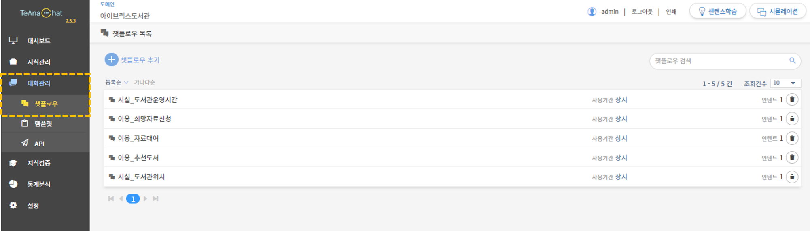
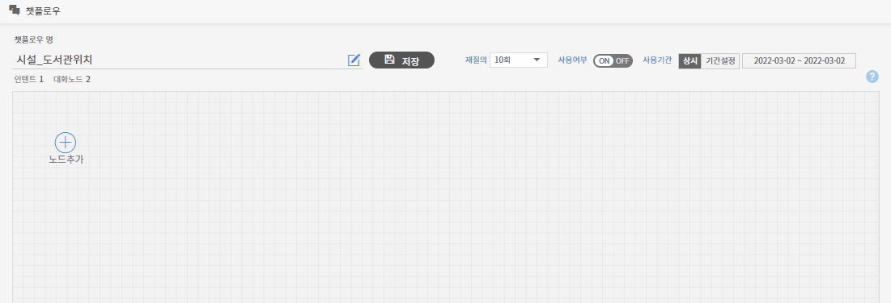

# 챗플로우

> 챗플로우(Chatflow)는 대화 흐름을 의미합니다. 챗플로우에 대한 상세한 정보는 아래의 자세히 알아보기 버튼을 눌러주시기 바랍니다.           &#x20;
>
> <mark style="color:blue;"></mark>[<mark style="color:blue;">챗플로우 자세히 알아보기 ></mark> ](../../undefined/undefined-4.md#1.)

## **1**. 챗플로우 설정

대화의 흐름을 설정하기 위해서는 챗플로우를 생성하고 편집해야 합니다. 관리도구 좌측의 **\[대화관리 > 챗플로우] 메뉴**를 통해 챗플로우 생성 및 관리가 가능합니다.

### 1-1. 챗플로우 추가

챗플로우 목록 페이지에서 .png>)챗플로우 추가 버튼을 클릭하고 챗플로우 명을 입력한 후, .png>) 버튼을 클릭하거나 엔터를 누르면 신규 챗플로우가 생성됩니다. 챗플로우 명은 인텐트 명과 동일할 것을 권장합니다.&#x20;

.gif>)

### 1-2. 챗플로우 목록&#x20;

챗플로우 목록 페이지에서는 생성된 챗플로우 리스트, 총 챗플로우 수, 챗플로우에 속한 인텐트 수를 확인할 수 있습니다. 챗플로우 목록 화면의 각 기능에 대한 상세 안내입니다.

➊ **챗플로우 정렬**

챗플로우 리스트를 등록순이나 가나다순으로 정렬할 수 있는 기능입니다.

➋  **챗플로우 검색**&#x20;

찾으려는 챗플로우 이름이나 포함된 키워드를 입력 후 엔터 또는  .png>) 아이콘을 클릭하면 검색 결과가 나옵니다.

➌ **챗플로우 삭제**

삭제하고 싶은 챗플로우의 휴지통 아이콘 클릭하면 목록에서 삭제됩니다.

➍ **챗플로우 상세 내용 확인 및 수정**

챗플로우 목록 내의 챗플로우 명을 클릭하면 각 챗플로우별 세부 관리 페이지로 이동합니다.&#x20;

### 1-3. 챗플로우 세부 관리 &#x20;

챗플로우 목록 페이지에서 특정 챗플로우명을 클릭하면 해당 챗플로우의 관리 페이지로 진입할 수 있습니다. 챗플로우 관리 화면에서는 챗플로우 명의 변경, 노드 편집 및 관리를 할 수 있습니다. 챗플로우 관리 화면의 각 기능에 대한 상세 안내입니다.

➊ **챗플로우 명 확인 및 수정**&#x20;

수정 아이콘  을 클릭하고 챗플로우 명을 변경 후  버튼을 눌러야 저장됩니다.

&#x20;

➋ **저장 버튼**

챗플로우 내용 수정 후 반드시 저장 버튼을 눌러야 수정 사항이 적용됩니다.         &#x20;

➌ **재질의 설정**&#x20;

재질의 파라미터가 구축된 챗플로인 경우, 재질의 횟수를 설정할 수 있습니다. '없음'인 경우에는 대화 종료 상태로 설정됩니다.              &#x20;

➍ **사용 여부 및  기간**&#x20;

사용 여부가 'ON'인 경우, '상시' 혹은  '기간설정'으로 챗플로우의 활성 기간을 설정합니다.      &#x20;

➎ **챗플로우 편집 작업 공간**

챗플로우를 편집하고 관리하는 공간으로 챗플로우에 연계된 인텐트의 대화 흐름을 볼 수 있습니다.           &#x20;

* **챗플로우 생성**

챗플로우 편집 작업 공간에서 <mark style="color:blue;"></mark> **노드 추가** 버튼을 클릭하면 노드 선택 창에서 적용을 누르면 챗플로우가 생성됩니다. 대화노드는 챗플로우의 기본 구성 요소입니다. 자세한 정보는 챗플로우 편집에서 확인할 수 있습니다.            ****       &#x20;

.gif>)


**챗플로우 등록 시 주의사항**

자동으로 저장이 되지 않기 때문에 변경 내역이 있을 경우, 꼭 저장을 해야 합니다.             &#x20;


## **2**. 챗플로우 편집

챗플로우를 편집하기 위해서는 챗플로우의 기본 구성 요소인 대화노드에 대한 개념을 알아야 합니다.

### 2-1. 대화노드

대화노드란 챗플로우 최소 단위이며, 질의 분석, 판단, 정보 구성 기능을 가지고 있습니다. 대화의 흐름을 이 노드 단위로 설정할 수 있습니다.

챗플로우 내 연계될 수 있는 대화노드의 종류는 인텐트 대화노드,  API 대화노드, 조건 대화노드, 응답메시지 대화노드, 리다이렉션 대화노드 총 5개입니다. 각각의 사용법에 차이가 있으며, 선행하는 대화노드가 무엇이냐에 따라 연결할 수 있는 대화노드 수도 달라집니다. &#x20;

이 대화 노드 위로 마우스를 옮기면 편집 메뉴 사용이 가능해집니다. 대화노드 편집 시 상세 기능 안내입니다.

➊ **인텐트 선택**&#x20;

&#x20;**** 인텐트 리스트에서 필요한 인텐트를 선택해서 대화노드를 생성할 수 있습니다.

&#x20;   ****&#x20;

➋ **하위레벨 대화노드 생성(끼워넣기)**&#x20;

기준이 되는 대화노드와 연계된 하위레벨의 대화노드를 추가하거나 기존의 대화노드 사이에 신규 대화노드를 끼워넣을 수 있습니다.         &#x20;

➌ **하위레벨 대화노드 생성**&#x20;

기준이 되는 대화노드와 연계된 하위레벨의 대화노드를 추가할 수 있습니다.          &#x20;

➍ **하위레벨 대화노드 전체 삭제**

삭제하고 싶은 대화노드의 휴지통 아이콘을 누르면 삭제됩니다.    ****&#x20;

****

### 2-2. 대화노드 종류별 설정 방법

챗플로우 추가 시에 대화노드의 종류에 따라 설정 방법이 다릅니다.

* **인텐트 대화노드**

인텐트 대화노드란 챗플로우 안에 종속되는 대화 주제이며, 지식관리에 인텐트와 연결되는 대화노드입니다. 챗플로우 연결 상 다중 대화 주제를 다뤄야 할 시, 복수의 대화노드를 활용할 수 있습니다.


**챗플로우 인텐트 대화노드 설정 작업 TIP**

인텐트 관리 페이지에서 설정한 파라미터, 재질의, 응답, 챗플로우 설정은 챗플로우 내 인텐트 생성시 자동으로 설정됩니다. 설정 값은 챗플로우 관리에서 수정이 가능합니다.  &#x20;


****

* **재질의(Prompt) 대화노드**

재질의 대화노드는 인텐트 관리에서 설정된 값을 기준으로 만들어집니다. 챗플로우 관리화면에서 재질의 대화노드를 삭제할 수는 없으나 재질의 값을 설정할 수 있습니다.

* **API 대화노드**

API 대화노드란 사용자에게 외부 정보 및 컨텐츠 제공 시 활용하는 대화노드입니다. API 대화노드는 **대화관리 메뉴> API** 에서 구축한 값을 대화 흐름 내 적절한 위치에 두어, 사용자로 하여금 원하는 정보를 제공받을 수 있도록 설정할 수 있습니다.

.png>)


**API 대화노드 설정 작업 TIP**

API 대화노드는 챗플로우의 첫 노드에 위치할 수 있습니다.

예) 로그인 정보와 같은 사용자 개인정보를 활용해야 하는 경우, 인텐트 대화노드보다 앞서 등록할 수 있습니다.&#x20;


****

* **조건 대화노드**

조건 대화노드는 경우에 따라 답변 분기 설정 시 활용하는 대화노드입니다. API 대화노드로 얻은 정보 혹은 인텐트에 설정되어 있는 파라미터 값을 근거로 답변은 분기됩니다.

위 그림은 \[이용\_추천도서] 인텐트에서 \[도서\_종류] 파라미터 값에 따라 응답이 출력되도록 만들어진 챗플로우입니다.


**조건 대화노드 설정 작업 TIP**

인텐트 대화노드에 종속되어 있으므로, 인텐트 대화노드, API 대화노드 이후에만 설정 가능합니다.          &#x20;


****

* **응답메시지 대화노드**

응답메시지 대화노드는 사용자에게 최종적으로 제공되는 답변 설정 시 활용하는 대화노드입니다. 응답메시지 대화노드 설정 시 출력되는 박스에서는 응답, 템플릿, 커스텀 코드, 감정표현 등의 설정, 변경 및 삭제가 가능합니다.&#x20;

* **리다이렉션 대화노드**

리다이렉션 대화노드란 사용자가 분기된 답변 중 자신이 선택한 정보 외의 정보를 제공받고자 할 때 활용할 수 있는 대화노드입니다. 리다이렉션 대화노드를 통해 대화 중 이전 인텐트로 되돌아갈 수 있습니다. 리다이렉션 대화노드는 응답메시지 노드 이후에만 출력되며, 연결은 인텐트 대화노드에만 가능합니다.

