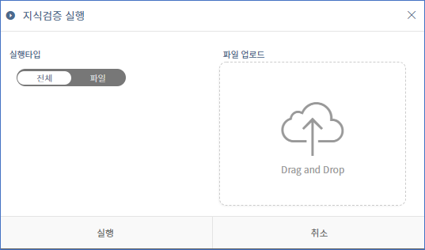
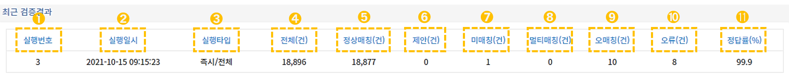
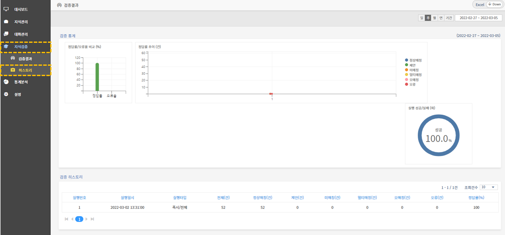
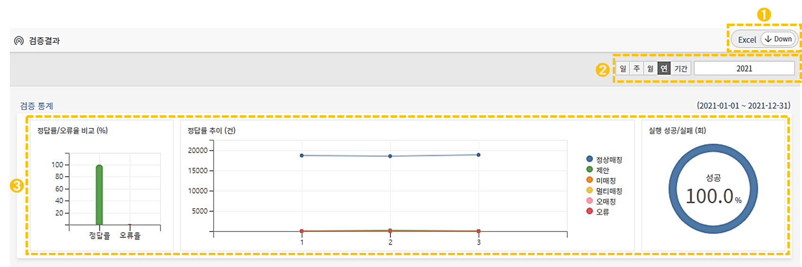

# 지식검증

## 1. 지식검증 개념

지식검증은 도메인의 센텐스에 대한 검증을 수행합니다. 지식검증을 통해 중복학습 문장 및 오분석 학습 문장, 다른 의도로 매칭된 내용을 검증하여 챗봇의 품질을 향상시킵니다.    &#x20;

## 2. 지식검증 실행

구축된 대화가 잘 학습되었는지 확인하기 위해서는 지식검증이 필요합니다. 관리도구 좌측의 **\[지식검증 > 검증결과] 메뉴**를 통해 지식검증 실행 및 관리가 가능합니다.

.png>)

지식검증 관리 화면의 상단에는 지식 검증을 수행하는 즉시 실행, 스케줄 설정, 엑셀 다운로드 버튼이 있습니다. 각 기능별 상세 내용은 아래와 같습니다.

➊ **스케줄**&#x20;

지식검증에 대한 정기적인 스케줄을 설정할 수 있습니다. 스케줄 버튼을 누르면 다음과 같은 설정창이 나타납니다.

* **사용여부 :** 스케줄에 대한 활성여부를 설정할 수 있습니다.
* **매주 :** 설정된 요일에 실행하는 스케줄을 설정할 수 있습니다.
* **매일 :** 매일 실행하는 스케줄을 설정할 수 있습니다.                   &#x20;

&#x20;

➋ **즉시실행** &#x20;

전체 센텐스 및 엑셀 파일 업로드를 통한 지식검증을 수행할 수 있습니다. 즉시실행 버튼을 누르면 다음과 같은 설정창이 나타납니다. &#x20;

* **전체 :** 도메인 내 모든 센텐스에 대한 지식검증을 실행할 수 있습니다.
* **파일 :** 업로드한 엑셀 파일의 센텐스에 대한 지식검증을 실행할 수 있습니다.&#x20;
* **파일 업로드 :** 지식검증할 엑셀 파일을 드래그로 이동 후 업로드할 수 있습니다.                         &#x20;

➌ **엑셀 다운로드**&#x20;

검증결과 오류 유형에 대한 센텐스 목록을 다운로드할 수 있습니다. &#x20;

### 2-1. 지식검증 결과&#x20;

검증 결과에서는 도메인의 센텐스에 대한 상세 오류 유형을 확인할 수 있습니다. 검증 결과는 '최근 검증결과'와 '최근 검증결과(상세)' 화면으로 구성됩니다.         &#x20;

아래 화면은 지식 검증을 실행한 후에 나오는 **최근 검증결과 화면**입니다.

➊ **실행번호**&#x20;

지식검증 실행한 횟수를 나타냅니다. 실행 번호가 높을수록 최근 지식검증을 실행한 결과값입니다.         &#x20;

➋ **실행일시** &#x20;

마지막 지식검증을 실행한 일시를 보여줍니다.&#x20;

➌ **실행타입** &#x20;

지식검증을 실행했을 때 설정한 스케줄이나 즉시실행 타입을 보여줍니다.&#x20;

➍ **전체**&#x20;

지식검증이 실행된 전체 센텐스 수를 보여줍니다.

&#x20;&#x20;

➎ **정상매칭**&#x20;

사용자 발화와 해당 인텐트가 정상적으로 매칭된 경우의 수를 나타냅니다. 지식검증이 실행된 전체 센텐스 수와 비교하여 정상적으로 매칭된 건수를 확인할 수 있습니다.              &#x20;

➏ **제안**&#x20;

사용자 발화가 의도한 인텐트로 매칭되지 않고, 유사한 질의로 추천한 경우의 수를 나타냅니다.    &#x20;

➐ **미매칭**&#x20;

사용자 발화가 의도한 인텐트에 매칭되지 않은 경우의 수를 보여줍니다. &#x20;

➑ **멀티매칭**&#x20;

사용자 발화가 의도한 하나의 인텐트가 아닌 다른 비슷한 인텐트 여러 개에 매칭된 경우의 수를 보여줍니다. &#x20;

➒ **오매칭**&#x20;

사용자 발화가 의도한 인텐트가 아닌 다른 인텐트로 잘못 매칭된 경우의 수를 나타냅니다.

&#x20;&#x20;

➓ **오류**&#x20;

제안/미매칭/멀티매칭/오매칭이 아닌 그 외 기타에 해당하는 경우의 수를 나타냅니다.

&#x20;      &#x20;

⓫ **진행률/정답률**&#x20;

지식검증 진행 비율 및 검증 완료 후 정답률을 보여줍니다.    &#x20;

아래 화면은 지식 검증을 실행한 후에 나오는 **검증결과 상세 화면**입니다.   &#x20;

검증결과 상세에서는 정상매칭이 아닌 인텐트, 센텐스, 응답메시지/제안센텐스, 오류 유형을 확인할 수 있으며 오류 유형별 검색도 가능합니다. '정상매칭' 센텐스의 경우 엑셀 다운로드로 확인할 수 있습니다.

➊ **인텐트**

오류 센텐스에 해당하는 인텐트 명입니다.

&#x20;    &#x20;

➋ **센텐스**&#x20;

오류 센텐스에 해당하는 사용자 발화 센텐스를 확인할 수 있습니다.

&#x20; &#x20;

➌ **응답인텐트/제안센텐스**&#x20;

매칭된 인텐트와 사용자에게 제안한 센텐스를 보여줍니다.&#x20;

➍ **오류유형**&#x20;

제안/미매칭/멀티매칭/오매칭/에러에 해당하는 오류 유형을 나타냅니다.  &#x20;

## 3. 히스토리

지식검증을 실행한 이후에, 완료된 지식검증 결과의 히스토리를 확인할 수 있습니다. 관리도구 좌측의 **\[지식검증 > 히스토리] 메뉴**를 통해 히스토리 확인 및 관리가 가능합니다.&#x20;

지식검증 히스토리에서는 정답률/오류율 등의 검증 통계를 시각적으로 표현하였으며 현재까지 실행된 검증 내역을 구체적으로 확인할 수 있습니다. 히스토리는 '검증 통계'와 '검증 히스토리' 화면으로 구성됩니다.     &#x20;

검증 통계 화면의 각 기능에 대한 상세 안내입니다.

➊ **검증 기록 다운로드**

검증 기록을 엑셀 파일로 다운받을 수 있습니다. ****        &#x20;

****

➋ **검증 기간 필터 및 입력**&#x20;

일간/주간/월간/특정기간/특정일을 지정할 수 있으며 선택 시 달력이 활성화됩니다.

➌ **검증 통계**

지식 검증 결과에 대한 통계 내역을 그래프로 확인할 수 있습니다.       ****       &#x20;

* **정답률/오류율 비교** : 정답률과 오류율을 비교하여 나타낸 막대 그래프입니다.        &#x20;
* **정답률 추이** : 각 오류 유형별 건수를 비교하여 나타낸 꺾으선 그래프입니다.&#x20;
* **실행 성공/실패** : 지식 검증을 실행한 성공율과 실패율을 비교한 원형 그래프입니다. 성공율은 파란색, 실패율은 빨간색으로 표시됩니다.                        &#x20;

검증 통계 화면 아래에 위치한 검증 히스토리 화면에서는 지식 검증을 실행했던 히스토리 세부 내역을  확인할 수 있습니다. &#x20;

.png>)
