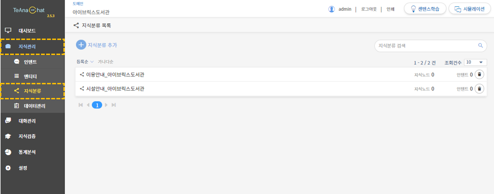

# 지식 분류

## 1. 지식분류 개념

지식분류(Taxonomy)란 운영 및 관리의 용이함을 위하여, 등록한 인텐트를 원하는 분류 체계 및 상하위 구조로 정리하고 지식을 관리하는 기능입니다.

## 2. 지식분류 구조

지식분류는 상하위 구조로 표현할 수 있습니다. 한 개의 지식노드는 여러 개의 지식노드로 구성되어 있으며, 지식노드는 여러 개의 인텐트를 포함합니다.&#x20;

지식분류의 구조를 시각화하면 다음과 같습니다.

## 3. 지식분류 설정

대화를 설계한 후 대화 관리가 용이하기 위해서 지식분류를 활욯할 수 있습니다. 관리도구 좌측의 **\[지식관리 > 지식분류] 메뉴**를 통해 지식분류 생성 및 관리가 가능합니다.

### 3-1. 지식분류 추가

지식분류 목록 페이지에서 .png>) 인텐트 추가 버튼을 클릭하고 지식분류 명을 입력한  후, .png>) 버튼을 클릭하거나 엔터를 누르면 신규 지식분류가 지식분류 목록에 생성됩니다.


**지식분류명 작성 TIP**

&#x20; &#x20;


### 3-2. 지식분류 목록 &#x20;

지식분류 목록 화면에서는 생성된 지식분류 목록과 지식분류에 종속된 지식노드/인텐트 숫자를 확인할 수 있습니다. 지식분류 화면의 각 기능에 대한 상세 안내입니다.

➊ **지식분류 정렬**&#x20;

지식분류 리스트를 등록순이나 가나다순으로 정렬할 수 있는 기능입니다.

➋ **지식분류 검색**&#x20;

지식분류 이름이나 찾으려는 지식분류의 키워드를 입력 후 엔터 또는  .png>) 아이콘을 클릭하면 검색 결과가 나옵니다.&#x20;

&#x20; &#x20;

➌ **지식분류 삭제**&#x20;

삭제하고 싶은 지식분류의 휴지통 아이콘을 클릭하면 목록에서 삭제됩니다.  &#x20;

➍ **지식분류 상세 내용 확인 및 수정**

지식분류 목록 내의 지식분류 명을 클릭하면 각 지식분류별 세부 관리 페이지로 이동합니다.

### 3-3. 지식분류 세부 관리

지식분류 목록에서 특정 지식분류 관리 페이지로 넘어갈 수 있습니다. 지식분류 관리 화면에서는 지식분류 명의 변경, 하위 노드 편집을 할 수 있습니다.

➊ **지식분류 명 확인 및 수정**&#x20;

수정 아이콘  클릭하고, 인텐트의 명칭을 변경하고 저장  을 클릭합니다. &#x20;

➋ **저장 버튼**

반드시 수정 후 저장 버튼을 눌러야 수정사항이 저장됩니다.   ****    &#x20;

➌ **지식분류 편집 작업 공간**

지식분류를 편집하고 관리하는 공간으로 지식분류별 종속된 인텐트의 분류를 확인할 수 있습니다.   &#x20;

****

➍ **인텐트 검색**&#x20;

인텐트 이름이나 찾으려는 인텐트의 키워드를 입력 후 엔터 또는  .png>) 아이콘을 클릭하면 검색 결과가 나옵니다. &#x20;

➎ **구축된 인텐트 리스트**

구축된 인텐트 내역을 확인할 수 있고 지식분류에 추가된 인텐트의 경우 색으로 구분이 가능합니다.

&#x20; ****         &#x20;

### 3-4. 지식분류 편집

지식분류를 편집할 때 사용하는 기능에 대한 상세 안내입니다.&#x20;

* **지식노드 생성**

.gif>)

마우스를 생성된 지식분류 위로 옮기면 .png>)버튼이 나타나며 버튼을 누르면 신규 지식노드를 추가할 수 있습니다.      &#x20;

* **지식노드에 인텐트 추가**

마우스로 우측에 있는 인텐트 목록을 드래그해서 지식노드로 이동시키면 아이콘 색깔이 변경되고 해당 지식노드에 종속됩니다.  &#x20;

* **지식노드 편집**&#x20;

지식노드 위로 마우스를 옮기면 편집 메뉴 사용이 가능해집니다.

➊ **지식노드 삭제**

➋ **하위 레벨 지식노드 생성**

➌ **같은 레벨의 지식노드 생성**

➍ **인텐트 제거**

* **지식노드 순서 변경**&#x20;

같은 레벨의 지식노드가 2개 이상일 때, 지식 노드 사이에 있는 버튼을 누르면 순서를 변경할 수 있습니다.
