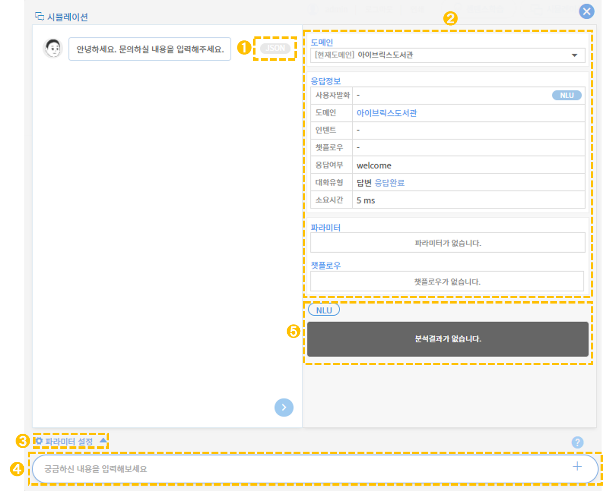

# 시뮬레이션

## 1. 시뮬레이션 개념

시뮬레이션은 구축된 지식 및 챗플로우를 테스트할 수 있는 환경을 제공합니다. 실제 대화 형식으로 챗봇과 대화를 나누며 알맞은 답변과 생성된 흐름으로 진행되는지 확인할 수 있습니다.&#x20;

## 2. 시뮬레이터 구조

시뮬레이션을 구동하는 시뮬레이터는 대화를 진행할 수 있는 시뮬레이터와 대화 결과를 분석할 수 있는 NLU 상세로 구성됩니다. NLU 결과를 확인함으로써, 더 나은 지식을 구축할 수 있도록 도와줍니다.

시뮬레이터의 구조를 시각화하면 다음과 같습니다.&#x20;

## 3. 시뮬레이터 실행

우측 상단의  버튼을 누르면 어떤 화면에서도 시뮬레이터로 진입할 수 있습니다. 시뮬레이터에서는 사용자 발화의 답변 및 상세 결과를 확인할 수 있습니다.

➊ **JSON 결과**&#x20;

챗봇 응답 메시지 옆 JSON 버튼을 누르면 JSON 결과 창이 나타납니다. 챗봇 API 응답(Response) 결과를 확인할 수 있습니다.

.png>)

➋ **사용자 발화 분석**

대화창 오른쪽에 사용자 발화문 분석 결과가 나타납니다. 해당 발화문의 의도 분석 결과, 챗플로우 결과, 답변 소요시간 등을 알 수 있습니다.       ****   &#x20;

&#x20;   &#x20;

➌ **파라미터 설정**&#x20;

해당 버튼을 누르면 공통 파라미터를 설정할 수 있습니다. 공통 파라미터는 해당 도메인 내  어떤 인텐트나 챗플로우에서도 참조할 수 있으며, 요청(Request)파라미터 및 API에서 값을 연결할 수 있습니다.              &#x20;

➍ **사용자 발화 입력창** &#x20;

테스트하고 싶은 센텐스를 입력 후  버튼 또는 엔터를 누르면 챗봇의 답변과 분석값이 나옵니다.

➎ **NLU**

사용자 발화문에 대한 NLU 분석 결과 창입니다.&#x20;

&#x20;                 ****             &#x20;

### 3-1. 사용자 발화 분석 결과

시뮬레이터를 실행했을 때 대화창 오른쪽에 나타나는 사용자 발화문 분석 결과 화면입니다. 각 분석별 상세 내용은 아래와 같습니다.&#x20;

.png>)

➊ **사용자 발화**&#x20;

사용자가 시뮬레이션을 위해 질의한 발화문입니다.         &#x20;

&#x20;&#x20;

➋ **도메인**&#x20;

현재 실행 중인 도메인 명입니다. 도메인 명을 클릭하면 해당 도메인 페이지로 이동합니다.     &#x20;

➌ **인텐트**&#x20;

사용자 발화문에 매칭된 인텐트 명입니다. 인텐트 명을 클릭하면 해당 인텐트 관리 페이지로 이동합니다.      &#x20;

➍ **챗플로우**&#x20;

사용자 발화문 의도 분석 결과, 매칭된 챗플로우를 보여줍니다. 챗플로우 명을 클릭하면 해당 챗플로우 관리 페이지로 이동합니다.

&#x20;      &#x20;

➎ **응답 여부**

아래 4가지 유형을 통해 응답 여부를 나타냅니다.    ****  &#x20;

* match : 응답
* not match : 미응답
* multi intent : 멀티인텐트
* end message : 종료메시지

➏ **대화유형**

아래 2가지 **** 유형을 통해 대화 유형의 정보를 전달합니다.   ****    &#x20;

* 답변/재질의 : 답변 또는 재질의 유형 정보
* 대화진행중/응답완료 : 대화 종료 여부

&#x20;      &#x20;

➐ **소요시간**&#x20;

질의에 대한 응답의 소요시간을 나타냅니다.     &#x20;

&#x20;&#x20;

➑ **파라미터**&#x20;

사용자 발화문에 매칭된 파라미터 값의 정보를 나타냅니다.    &#x20;

➒ **챗플로우**&#x20;

현재 진행 중인 대화 흐름을 보여줍니다.&#x20;

### 3-2. NLU 분석 결과

시뮬레이터를 실행했을 때 사용자 발화문 분석 결과 아래에 나타나는 NLU 분석 결과 화면입니다. 각 분석별 상세 내용은 아래와 같습니다.

.png>)

➊ **인텐트**&#x20;

사용자 발화문에 매칭된 인텐트 명, ID를 나타냅니다.&#x20;

➋ **응답기준**&#x20;

사용자 발화문의 학습 결과 유형을 보여줍니다.&#x20;

* grammar : 구문학습
* learning : 기계학습

➌ **Score** &#x20;

대화 의도의 매칭 정확도를 보여줍니다.&#x20;

➍ **Offset**&#x20;

* offset : 매칭 시작 지점
* len : 매칭 문자 개수

➎ **파라미터**&#x20;

사용자 발화문에 매칭된 파라미터 ID 및 값을 나타냅니다.

&#x20;

➏ **지식분류**&#x20;

사용자 발화문에 매칭된 지식분류 명을 보여줍니다.

&#x20;

### 3-3. 파라미터 설정

사용자 발화 입력 창 위에 **파라미터 설정** 버튼을 누르면 SESSION ID와 파라미터 값을 직접 입력하여 설정할 수 있습니다. 파라미터 값이 설정되어 대화가 진행되어야 할 때 사용하는 기능이며, 값에 따라 결과에 영향을 미칩니다.

➊ **SESSION ID**&#x20;

SESSION ID 직접 입력해서 설정합니다.

&#x20;

➋ **파라미터 추가** &#x20;

설정할 파라미터 명/파라미터 값을 입력한 후 .png>) 버튼을 클릭하면 생성됩니다.&#x20;

&#x20;

### 3-4. NLU 상세

사용자 발화문 분석 결과 화면에서 사용자 발화 칸의 우측에 위치한  버튼을 누르면 해당 사용자 발화문의 NLU 분석 상세 탭으로 전환하여 결과를 확인할 수 있습니다.

➊ **분석문 입력창**

➋ **사용자 발화문에 대한 NLU 분석 결과**  &#x20;
