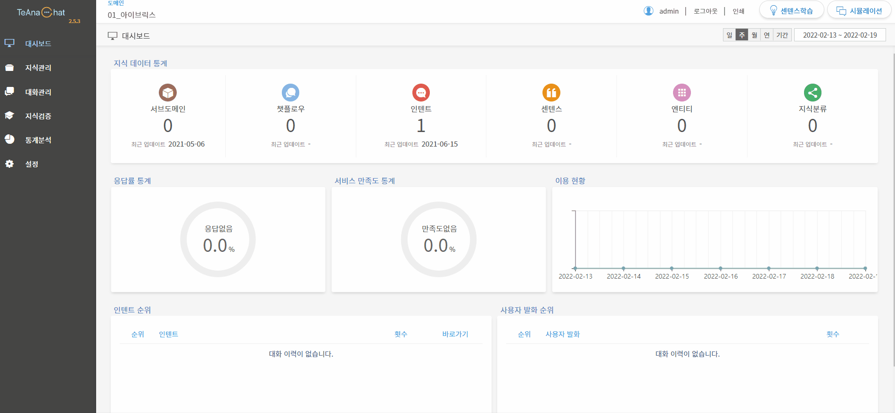

# 도메인 만들기

> 도메인(Domain)은 Teana Studio에서의 가장 큰 지식 단위입니다. 도메인에 대한 상세한 정보는 아래의 자세히 알아보기 버튼을 눌러주시기 바랍니다.
>
> [도메인 자세히 알아보기 >](broken-reference)

## 1. 도메인 관리 경로

관리도구 좌측 상단의 현재 도메인명을 클릭하면 생성된 도메인 목록을 볼 수 있습니다. 다른 도메인명을 클릭하면 해당 도메인으로 전환할 수 있습니다. **도메인관리** 버튼을 누르면 도메인 관리 페이지로 접근할 수  있습니다.        &#x20;

## 2. 도메인 관리

도메인 관리 페이지는 신규 도메인 생성을 위한 ‘도메인 추가’와 생성된 도메인의 정보를 볼 수 있는 '도메인 목록'으로 구성됩니다.

### 2-1. 도메인 추가

도메인 관리 페이지에서 도메인 추가 버튼 을 클릭하면 도메인 설정창이 나타납니다. 신규 도메인을 생성하기 위해 도메인의 정보값을 입력하는 창으로, 도메인 ID 및 이름, 설명 등을 설정할 수 있습니다. 설정 완료 후 저장 버튼을 누르면 신규 도메인이 생성됩니다.

❶ **도메인 그림 설정**

이미지 업로드 버튼 클릭 시 도메인의 대표 이미지를 설정할 수 있습니다. 도메인이 가지고 있는 주제 등이 잘 드러나는 이미지로 업로드하는 것이 좋으며, 업로드된 이미지는 도메인 전환 시 프로필 이미지처럼 나타나게 됩니다.

❷ **도메인 ID **<mark style="color:red;">**(필수 입력)**</mark>

도메인ID는 영소문자 및 숫자, -(하이픈), \_(언더바) 등을 활용해 지정 가능합니다. 도메인 ID는 저장 후 수정이 불가능하므로 설정 시 유의해주시기 바랍니다.

**❸ 도메인 이름 **<mark style="color:red;">**(필수 입력)**</mark>

도메인을 식별하기 위한 이름을 지정할 수 있습니다.&#x20;

❹ **도메인 설명**

해당 도메인에 대한 설명이 필요한 경우, 관련 내용을 입력할 수 있습니다.

### 2-2. 도메인 목록&#x20;

도메인 목록에서는 각 도메인별 지식 현황을 한눈에 살펴볼 수 있으며, 도메인 수정 및 삭제 등의 관리가 가능합니다. 도메인 이름을 클릭하는 경우, 해당 도메인 페이지로 이동합니다.

**❶ 도메인 수정 및 삭제**

마우스 커서를 원하는 도메인 위로 이동하면 도메인 삭제와 정보 수정 등을 위한 버튼이 나타납니다.&#x20;

*   **도메인 수정**&#x20;

    수정 버튼 클릭 시, 도메인의 이름 및 설명을 수정할 수 있습니다. 도메인 ID는 수정이 불가능합니다.
*   **도메인 삭제**

    도메인 삭제 버튼 클릭 시, 삭제를 위한 알림창이 나타납니다. 삭제한 도메인은 다시 복구할 수 없으므로 유의해주시기 바랍니다.

❷ **도메인 현황**

각 도메인의 구조 관리([서브도메인](../undefined/undefined.md#1-1.))와 인텐트, 엔티티, 센텐스, 챗플로우 등의 지식 현황을 바로 확인할 수 있습니다. 서브도메인을 클릭하면, 해당 도메인의 서브도메인을 구성할 수 있습니다.

*   **서브도메인 관리**

    전체 도메인 중 서브도메인로 등록하고 싶은 도메인에서 추가 버튼 .png>)을 클릭하면, 해당 도메인이 서브도메인으로 등록됩니다. 등록된 서브도메인 목록에서 삭제 .png>)및 순서 변경.png>)도 가능합니다.

