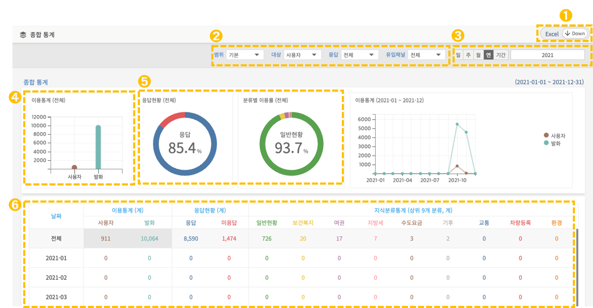
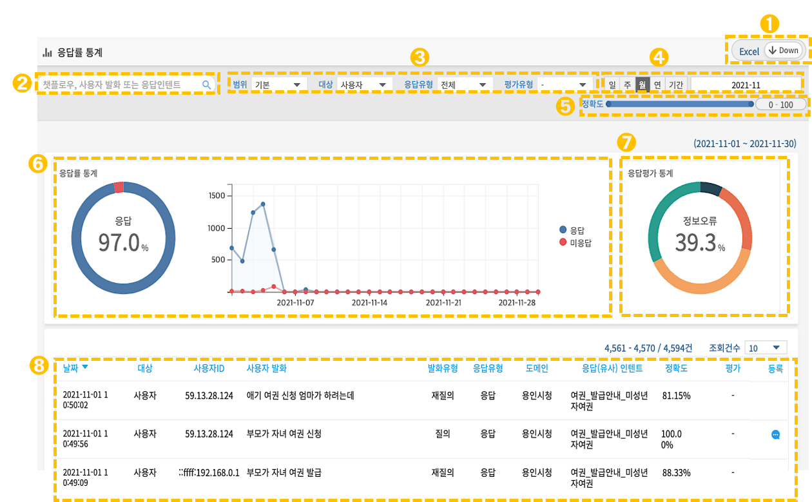
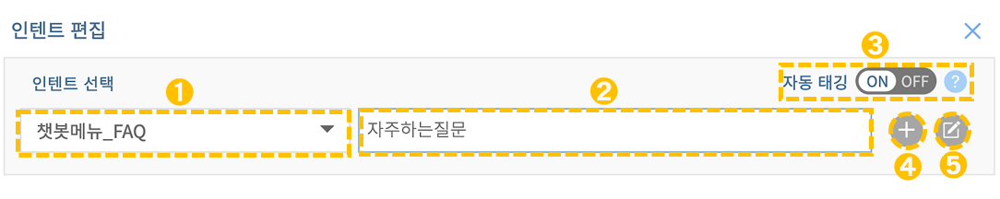

# 사용 통계 관리

## 1. 통계분석 개념

통계 분석에서는 사용자의 발화와 응답 이력 분석을 바탕으로 한 여러 종류의 통계 정보를 볼 수 있습니다. 통계 분석을 통해, 챗봇 서비스의 품질을 향상할 수 있습니다.

## 2. 통계분석 구조

통계 분석에서는 사용자 발화와 응답 이력 분석에 기반한 여러 종류의 통계 정보를 볼 수 있습니다. 발화와 응답 내용은 elasticSearch에 저장되며, 저장된 내용을 분석하여 통계 정보를 제공합니다. 이러한 통계 분석을 통해 챗봇 서비스의 품질을 향상시킬 수 있습니다.

통계분석의 구조를 시각화하면 다음과 같습니다.

.png>)

## 3. 통계분석 관리

관리도구 좌측의 **\[통계분석] 메뉴**를 통해 유형별 통계 정보를 확인 및 관리가 가능합니다. 통계 분석은 '종합 통계', '응답률 통계', '사용자 대화통계'로 구성되어 있습니다.

.png>)

### 3-1. 종합 통계

관리도구 좌측의 **\[통계분석>종합통계] 메뉴**를 통해 종합적인 통계를 확인할 수 있습니다.   &#x20;

종합 통계에서는 이용 통계, 응답 현황, 상위 최대 10개 분류의 이용률을 시각적으로 파악할 수 있으며 사용자의 관심도가 높은 인텐트 순위를 확인할 수 있습니다.

➊ **엑셀 다운로드**

대화 로그 기록을 엑셀로 일괄 다운로드 할 수 있습니다.

&#x20;  ****     &#x20;

➋ **범위/대상/유입채널 필터**&#x20;

로그 기록에 대한 원하는 조건을 선택해서 해당 결과만 확인할 수 있습니다.    &#x20;

* **범위 :** 기본(해당 도메인) 확장(해당 도메인/서브 도메인)으로 선택할 수 있습니다.

.png>)

➌ **응답 기간 필터 및 입력**&#x20;

응답한 일간/주간/월간/특정기간/특정일을 지정할 수 있으며 선택 시 달력이 활성화됩니다.

.png>)

➍ **이용 통계**&#x20;

대화 섹션 기준 집계된 사용자 수 및 총 발화 유입량을 확인할 수 있습니다.   &#x20;

&#x20;        &#x20;

➎ **응답 현황/분류별 이용률**    &#x20;

* **응답 현황 :** 응답 및 미응답 총계를 나타냅니다.
* **분류별 이용률 :**  지식분류별 이용률을 나타냅니다.         &#x20;

➏ **통계 출력**

원하는 기준 항목 선택 시 해당 통계를 출력합니다.&#x20;

* **날짜**
* **이용통계 :** 사용자 및 발화 총계입니다.
* **응답현황 :** 응답 및 미응답 총계입니다.
* **지식분류통계 :** 상위 최대 10개 지식분류 총계입니다.

### 3-2. 응답률 통계

관리도구 좌측의 **\[통계분석>응답률 통계] 메뉴**를 통해 챗봇의 응답률 통계를 확인할 수 있습니다.&#x20;

응답률 통계에서는 사용자에 대한 챗봇의 응답여부를 시각적으로 파악할 수 있으며, 미응답한 발화를 인텐트에 추가하여 챗봇 품질을 향상시킬 수 있습니다. 로그 기록 또한 다운로드할 수 있습니다.

➊ **사용자발화 검색**&#x20;

찾으려는 챗플로우, 사용자 발화 또는 응답인텐트 등 포함된 포함된 키워드를 입력 후 엔터 또는  .png>) 아이콘을 클릭하면 검색 결과가 나옵니다.

➋ **범위/대상/응답유형/평가유형 필터** &#x20;

로그 기록에 대한 원하는 조건을 선택해서 해당 결과만 확인할 수 있습니다.   &#x20;

.png>)

➌ **응답 기간 필터 및 입력**&#x20;

응답한 일간/주간/월간/특정기간/특정일을 지정할 수 있으며 선택 시 달력이 활성화됩니다.   &#x20;

➍ **정확도 필터**&#x20;

정확도의 최저치와 최대치를 드래그로 이동시켜 조정이 가능합니다.  &#x20;

➎ **엑셀 다운로드**&#x20;

대화 로그 기록을 엑셀로 일괄 다운로드 할 수 있습니다.

➏ **응답률**&#x20;

로그에서 챗봇의 응답 여부를 파이 차트로 시각화하고 시계열 자료는 라인 차트로 나타냅니다.

&#x20;      &#x20;

➐ **응답평가**&#x20;

챗봇의 응답 품질에 대한 사용자 응답평가 통계를 확인할 수 있습니다.

&#x20;        &#x20;

➑ **사용자 발화 로그** &#x20;

항목별로 정리된 사용자 발화 로그 기록 내역입니다.       &#x20;

* **날짜**
* **대상 :** 대상이 사용자/시뮬레이션인지 표시합니다.
* **사용자발화 :** 사용자가 실제로 채팅창에 입력한 센텐스입니다.
* **발화유형 :** 발화가 **** 질의/재질의인지 표시합니다.
* **응답유형 :** 응답유형이 **** 응답/제안/미응답인지 표시합니다.
* **응답인텐트 :** 사용자발화로 도출된 학습문장 (센텐스)의 인텐트를 나타냅니다. &#x20;
* **정확도 :** 사용자발화와 학습문장(센텐스)의 유사성의 정도를 보여줍니다. &#x20;
* **평가 :** 정상매칭/오매칭/정보오류/기타로 사용자 평가가 표시됩니다.   &#x20;
* **등록 :** 인텐트 편집 기능으로 미 응답한 발화를 인텐트에 추가하여 챗봇 품질을 향상시킬 수 있습니다.                                &#x20;

#### 사용자 발화 등록하는 방법

미응답 또는 인텐트가 잘못 매칭된 경우, 통계 화면에서 해당 사용자발화를 학습문장(센텐스)로 등록할 수 있습니다.

➊ **인텐트 선택** &#x20;

사용자발화와 알맞은 인텐트를 선택합니다.

➋ **사용자발화**&#x20;

인텐트 선택시 나오는 사용자발화문으로 내용 수정이 불가능합니다.

➌ **자동태깅 ON/OFF**&#x20;

문장 등록 시 자동태깅 사용 여부를 선택할 수 있습니다.  &#x20;

➍ **센텐스 추가**

선택한 인텐트에 사용자발화를 센텐스로 등록할 수 있습니다. &#x20;

➎ **인텐트 수정**

선택한 인텐트 관리 페이지로 바로 이동할 수 있습니다. &#x20;

### 3-3. 사용자 대화통계

관리도구 좌측의 **\[통계분석>사용자 대화통계] 메뉴**를 통해 사용자가 챗봇과 대화한 기록을 확인할 수 있습니다.     &#x20;

사용자 대화이력은 유입채널 비중, 시간대별 사용자 수, 요일별 사용자 수, 대화 이력을 구체적으로 확인할 수 있습니다.

➊ **대화이력 검색**&#x20;

챗플로우, 사용자 발화 또는 사용자ID 등 포함된 포함된 키워드를 입력 후 엔터 또는  .png>) 아이콘을 클릭하면 검색 결과가 나옵니다.

➋ **대상별/채널별/만족도 필터**&#x20;

로그 기록에 대한 원하는 조건을 선택해서 해당 결과만 확인할 수 있습니다. &#x20;

.png>)

➌ **응답 기간 필터 및 입력**&#x20;

응답한 일간/주간/월간/특정기간/특정일을 지정할 수 있으며 선택 시 달력이 활성화됩니다.  &#x20;

➍ **사용자 이용 통계**&#x20;

유입채널 비중, 시간대별/요일별 사용자 수, 서비스 만족도 통계를 그래프로 확인할 수 있습니다.  &#x20;

➎ **대화 상세 내역** &#x20;

대화 이력 목록의 말풍선을 클릭시 대화 상세 내역(챗플로우)을 확인할 수 있습니다.

## 4. 통계설정

관리도구 좌측의 **\[설정 > 통계설정 ] 메뉴**를 통해 통계분석에 제공하는 자료와 로그에 대한 설정 및 관리가 가능합니다. 통계설정은 '로그 제외 처리', '통계 제외 처리'의 2가지 섹션으로 구성되어 있습니다.

### 4-1. 로그 제외 처리

대화기록(log)에 저장되지 않을 인텐트와 질의어를 설정하는 기능입니다. 데이터 통계는 대화기록을 통해 만들어지므로 대화기록에 저장되지 않으면 통계에서도 볼 수 없습니다.&#x20;

'인텐트 제외'와 '사용자 발화' 두 파트가 있으며 목록에서 확인 및 삭제가 가능합니다.

➊ **인텐트 제외**&#x20;

대화기록에 저장되지 않을 인텐트를 선택 후 .png>) 버튼을 클릭하면 해당 인텐트가 목록에 추가됩니다. &#x20;

&#x20;&#x20;

➋ **사용자 발화**&#x20;

대화기록에 저장되지 않을 질의어를 입력 후 .png>)버튼을 클릭 또는 엔터를 누르면 해당 사용자 발화가 목록에 추가됩니다.    &#x20;

➌,➍ **등록된 인텐트/사용자 발화 삭제**&#x20;

삭제하고 싶은 인텐트나 사용자 발화의버튼을 클릭하면 목록에서 삭제됩니다.

&#x20; &#x20;

### 4-2. 통계 제외 처리

대화기록(log)에는 저장되지만 데이터 통계에서 보여지지 않는 인텐트와 질의어를 설정합니다. 로그 제외 처리와 달리 로그가 남기 때문에  별도의 작업으로 추후 다시 확인할 수 있습니다.&#x20;

'인텐트 제외'와 '사용자 발화' 두 파트가 있으며 목록에서 확인 및 삭제가 가능합니다.

➊ **인텐트 제외**&#x20;

데이터 통계에서 제외될 인텐트를 선택 후 .png>) 버튼을 클릭 또는 엔터를 누르면 해당 인텐트가 목록에 추가됩니다.    &#x20;

➋ **사용자 발화 등록** &#x20;

데이터 통계에서 제외될 질의어를 입력 후 .png>)버튼 클릭 또는 엔터를 누르면 해당 사용자 발화가 목록에 추가됩니다.    &#x20;

➌,➍ **등록된 인텐트/사용자 발화 삭제**&#x20;

삭제하고 싶은 인텐트나 사용자 발화의버튼을 클릭하면 목록에서 삭제됩니다.    &#x20;
