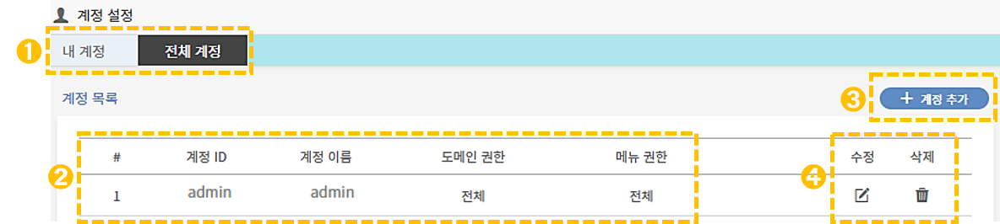

# 계정 설정

## 1. 계정 설정 안내

관리도구 좌측의 **\[설정 > 계정설정] 메뉴**를 통해 계정 확인 및 관리가 가능합니다. 접속한 내 계정을 확인 및 수정할 수 있으며, 현재 접속한 계정에 계정 권한을 부여한 경우 전체 계정에 대한 관리 기능을 함께 제공합니다.

계정 설정은 '내 계정'과 '전체 계정'으로 구성되어 있습니다. 계정설정 페이지 진입시 '내 계정' 화면이 기본값입니다. &#x20;

&#x20;  &#x20;

### 1-1. 내 계정

내 계정 설정 화면에서는 계정정보를 확인하고 권한을 설정할 수 있습니다.         &#x20;

➊ **현재 접속된 계정 정보 확인 가능**

* **계정 ID :** 현재 접속된 계정 아이디입니다.
* **계정 이름 :** 현재 접속된 계정 이름입니다.
* **도메인 권한 :** 계정이 접근할 수 있는 도메인을 설정할 수 있습니다. &#x20;
* **메뉴 권한 :** 계정이 접근할 수 있는 메뉴를 설정합니다.

&#x20;                   &#x20;

➋ **비밀번호 변경**&#x20;

비밀번호는 영문(대/소), 숫자, 특수문자 최소 3가지 사용하며 8\~24자리 내로 설정해야합니다.

### 1-2. 전체 계정

상단의 버튼 중 전체 계정을 선택하면 전체 계정으로 진입할 수 있습니다. 해당 메뉴는 "admin"계정에서만 접근 가능한 메뉴로 사용자 계정들을 관리할 수 있습니다.

➊ **계정 선택**&#x20;

내 계정/전체 계정 중 선택해서 해당 계정 설정으로 전환할 수 있습니다. '내 계정'이 기본 화면입니다.

➋ **계정 추가**

계정 추가 버튼을 눌러서 계정에 대한 권한과 설정값을 입력하면 목록에 신규 계정이 추가됩니다.&#x20;

&#x20; ****  &#x20;

.png>)

➌ **계정 정보**&#x20;

계정에 관한 정보를 확인할 수 있습니다. 계정 ID, 계정 이름, 도메인 권한, 메뉴 권한이 표시됩니다.

➍ **수정 및 삭제**

계정을 수정하거나 삭제하는 기능입니다. &#x20;

****
